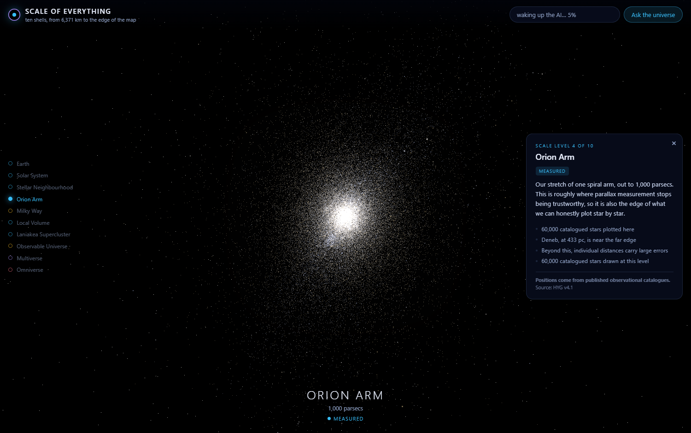
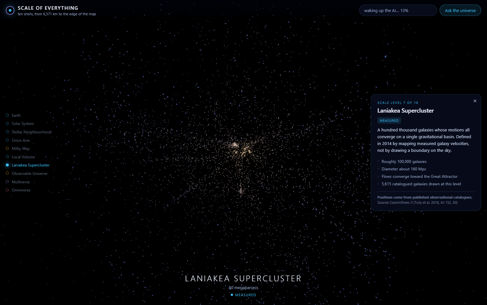
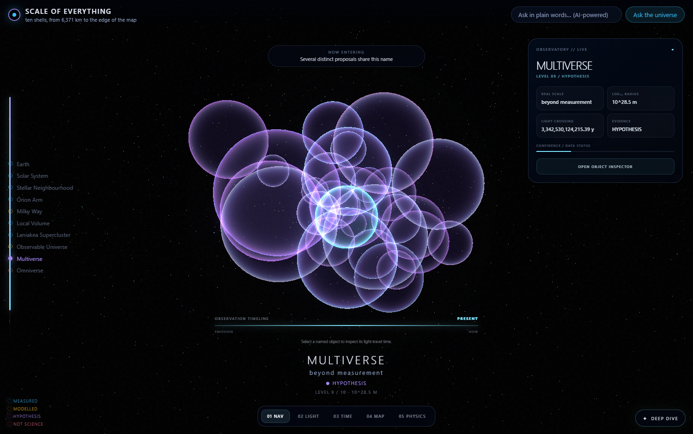
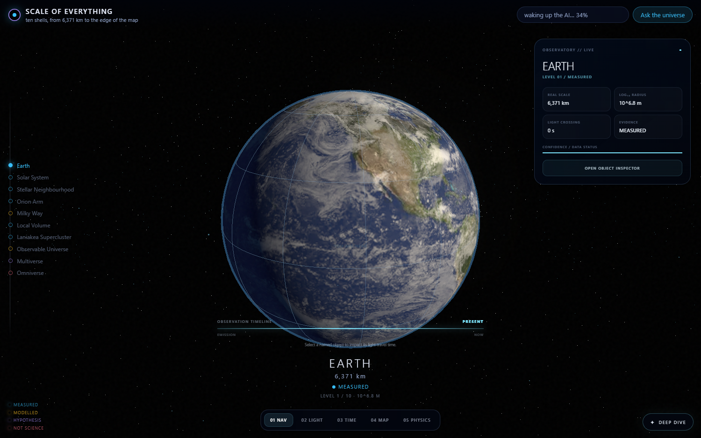

# Scale of Everything

An interactive zoom through ten scales of the universe, from the surface of one
planet to the edge of the observable universe — and then two steps further, into
territory that is explicitly labelled as not measured.

**Live:** <https://jeevan-0508.github.io/scale-of-everything/>

Built with three.js. No build step, no bundler, no server. Two AI models run
entirely in your browser: one for search by meaning, one for conversation.

---

## The idea

Most cosmic-zoom visualisations quietly blend measurement into artwork. A field
of stars looks the same whether every position came from a parallax
measurement or from a random number generator, and the viewer has no way to
tell which they are looking at.

This one draws the line explicitly. **Evidence status is a field in the data
model, not a footnote** — see `src/levels.js`:

| Tier | Meaning | Levels |
| --- | --- | --- |
| `measured` | Positions come from published observational catalogues | Earth, Solar System, Stellar Neighbourhood, Orion Arm, Local Group, Laniakea |
| `modelled` | Structure inferred, not individually observed | Milky Way, Observable Universe |
| `hypothesis` | A published but untested proposal | Multiverse |
| `notScience` | No scientific literature supports it as a physical structure | Omniverse |

Each tier renders in its own colour and its own visual language. You can tell
what kind of claim you are looking at without reading anything.

## Screenshots

Level 4 — the Orion Arm, 60,000 real catalogued stars. The field looks
spherical because the sample is magnitude-limited: this is our detection
horizon, not the arm's true shape, and the panel says so.



Level 7 — Laniakea. Real large-scale structure from measured distances: the
Virgo concentration in gold at centre, filaments radiating outward.



Level 9 — the Multiverse, drawn in a deliberately different visual language.
Eternal inflation describes a foam of bubbles that nucleate, inflate and touch,
so this shell is a foam: thin soap films in the hypothesis violet with our own
universe lit cyan. Nothing solid, no surface, no detail that could be mistaken
for an image of anything. You can tell at a glance that the ground has changed
from observation to proposal.



Level 1 — Earth, wearing the same measured surface, cloud and night-lights
maps as the planet one rung out, with the Karman line to scale.



## The ten shells

| # | Level | Extent | Evidence | Objects drawn |
| --- | --- | --- | --- | --- |
| 1 | Earth | 6,371 km | measured | real surface, clouds, night lights, Karman line to scale |
| 2 | Solar System | 39 AU | measured | Sun, 8 planets, the Moon, Pluto — real surfaces |
| 3 | Stellar Neighbourhood | 25 pc | measured | real stars, catalogued positions |
| 4 | Orion Arm | 1,000 pc | measured | 60,000 real stars |
| 5 | Milky Way | 26.8 kpc | **modelled** | procedural barred spiral |
| 6 | Local Group | 1.5 Mpc | measured | real galaxies |
| 7 | Laniakea Supercluster | 80 Mpc | measured | real galaxies |
| 8 | Observable Universe | 520 Mpc surveyed | **modelled** beyond survey depth | 17,669 real galaxies |
| 9 | Multiverse | beyond measurement | **hypothesis** | a foam of soap-film bubbles, schematic |
| 10 | Omniverse | undefined | **not science** | an empty box, deliberately |

## Why the Milky Way is the one galaxy that had to be faked

We are inside it. Dust blocks the far side of the disc, and no catalogue holds
individually measured positions for stars across it. HYG's parallax distances
become unreliable past roughly 1,000 parsecs, against a disc radius of
26.8 kiloparsecs — so real measurement covers under 4% of the radius.

Level 4 shows you every star we can actually place. Level 5 admits it is a
model. The Sun marker at 8.2 kpc and the 26.8 kpc disc radius are measured
values; the individual points are not stars.

## The precision problem, and the fix

Earth's radius is 6.371 × 10⁶ m. The observable universe is 8.8 × 10²⁶ m.
That is 20 orders of magnitude, and WebGL vertices are float32 — roughly 7
significant digits. In one coordinate system, everything either collapses to a
single pixel or shakes itself apart into vertex jitter.

The fix is **discrete scale shells**. Every level is built to the same radius in
scene units (`UNIT = 600` in `src/main.js`), so the renderer never sees a
coordinate outside a few thousand units. Scale lives in the readout, not in the
vertices. Zooming cross-fades between adjacent shells while the departing one
shrinks toward a point, which is what leaving a scale actually looks like.

## Data

Full provenance and licence terms: [`DATA-LICENSES.md`](DATA-LICENSES.md).

### Stars — HYG v4.1, CC BY-SA 4.0

60,000 stars packed to **1.2 MB** (20 bytes each: x, y, z, magnitude, colour
index), selected from 109,401 catalogue rows inside 1,000 pc. Every named star
is kept, then the remaining budget is filled with the brightest. 461 carry
proper names. Colour on screen is computed from the real B–V colour index, so
temperature is readable off the field.

### Galaxies — Cosmicflows-3, Tully et al. 2016

17,669 galaxies with **measured** distances from 0.05 to 517.61 Mpc, packed to
**0.35 MB**. Converted to supergalactic cartesian coordinates — the frame
Laniakea is defined in — so real structure reads as structure instead of
smearing across an arbitrary axis. 150 clusters with 5 or more members.

### Earth — the surface, the clouds and the lights, 1.0 MB shared with the rung above

The first shell wears the same measured surface as the Earth one level out, plus
a cloud composite and a night-lights layer. City lights are mixed in against the
Sun direction in a world-space normal, so they appear only on the half the Sun is
not lighting and fade across the terminator instead of glowing through daylight.

The globe turns under a fixed Sun rather than carrying its daylight around with
it, and the graticule is real parallels and meridians every 30 degrees instead of
a wireframe of the render mesh. The Karman line at 100 km is still drawn to scale
against the 6,371 km radius, which is the point of the rung: the entire
atmosphere is a film 1.6 per cent of the radius thick.

### Solar System — 11 real bodies, 0.9 MB

The Sun, all eight planets, the **Moon** and **Pluto**, each wearing the
equirectangular map that spacecraft mosaics were reprojected into, spinning about
a tilted axis at its own sidereal rate. Venus barely turns and turns backwards;
Uranus rolls on its side at 98 degrees; Jupiter turns fastest of the lot. Those
are not animation choices, they are the fact-sheet numbers.

**Saturn's rings are geometry, not a decal**: a ring mesh from 66,900 km to
136,775 km — the D ring's inner edge to the A ring's outer edge — with UVs
remapped to run radially so the Cassini Division falls where the texture's alpha
channel says it does, rather than being drawn in by hand.

Click any body and you get a single photograph beside the map: MESSENGER on
Mercury, Mariner 10 on Venus, Apollo 17 on Earth, Rosetta's OSIRIS on Mars,
Hubble on Jupiter, Cassini on Saturn, Voyager 2 on Uranus and Neptune, New
Horizons on Pluto. The Sun and the Moon are the two ground-based frames, both
from amateur astronomers, both credited as such.

The honest caveat, and the panel carries it every time: **a surface map is not a
photograph.** It is a mosaic of many frames taken at different times, angles and
resolutions, reprojected onto a rectangle. That is a weaker evidence claim than
the deep-sky images below, which are single exposures, and the project does not
blur the two. The four giant planets and Venus have no visible solid surface at all, so
their textures are labelled `cloud-top map` rather than `surface map`.

Orbital radii, body radii and the clock are all compressed to fit one display.
Compression is uniform, so every *ratio* between bodies stays real, and every
figure quoted in the panel is the uncompressed one. Figures: NASA planetary fact
sheets. Licences and credits: [`CREDITS.md`](CREDITS.md).

### Deep sky — 18 real photographs, 1.1 MB

Eighteen nebulae, star clusters and galaxies that a point cloud cannot show you:
the **Pillars of Creation**, the **Cat's Eye**, **Orion**, the **Crab**, the
**Helix**, the **Horsehead**, **Carina**, the **Veil**, the **Lagoon**, the
**Trifid**, the **Ring**, the **Dumbbell**, the **North America Nebula**, the
**Tarantula**, the **Pleiades**, **Omega Centauri**, the **Sombrero** and the
**Whirlpool**.

Each one is the image a telescope actually took — Hubble, JWST, ESO, NOIRLab —
under a free licence, downscaled to 760 px, WebP, with a soft edge fade baked
into the alpha channel so a rectangular photograph does not read as a rectangle
against the sky. **Nothing here is a render.** Full table of files, licences and
credits: [`CREDITS.md`](CREDITS.md).

Positions are SIMBAD `basic` (ICRS J2000) and apparent sizes are SIMBAD
`galdim`, both queried through the SIMBAD TAP service. Where SIMBAD carries no
size, the field is **omitted rather than guessed** — five objects have no
apparent size shown for exactly that reason.

Distances are the part worth reading. Every object records the *method* that
produced its distance alongside the number, because these are not all the same
kind of measurement:

- **Gaia parallax** of a central star or of the ionising cluster — the Ring,
  Helix, Dumbbell, Cat's Eye, Pleiades, Omega Centauri, Trifid, Eagle, Carina
- **VLBA trigonometric parallax** — Orion, 414 ± 7 pc (Menten et al. 2007)
- **Supernova-remnant expansion** — the Crab, ~2 kpc (Trimble 1973)
- **Three-dimensional dust mapping** — the North America Nebula (Zucker et al. 2020)
- **Inherited from a host or parent cloud** — the Tarantula from the LMC, the
  Horsehead from Orion B
- **Cosmicflows-3**, the catalogue this project already ships — Sombrero and Whirlpool

Where that method has a caveat, the caveat is shown in the panel next to the
number rather than buried: a single central-star parallax at 1.4 kpc is not the
same claim as a cluster mean, and the Pillars' parallax belongs to the cluster
lighting them, not to the dust.

The Whirlpool is anchored to the CF3 row for **NGC 5195**, its interacting
companion, because — as documented below — M51 itself has no individual CF3
distance. That is stated in the panel, not papered over.

Each rung shows only the objects that fall inside its own radius, assigned by
comparing published distance against shell radius rather than by hand: eight on
the Orion Arm, seven on the Milky Way, one on the Local Volume, two on Laniakea.

### Two data problems worth documenting

**Nothing was searchable.** CF3 designations have inconsistent zero-padding:
`NGC0224`, `NGC147` and `N4486` all coexist in one column. A normaliser plus a
curated alias table means "Andromeda", "M31" and "NGC 224" all resolve to the
same object.

**Four famous galaxies were filed under unrelated catalogue numbers.** M64
appears as `UGC08062`, M63 as `UGC08334`, NGC 253 as `AGC020535`, and name
matching could never have reached them. Keying on PGC — the stable LEDA
identifier — recovered all four, and their distances check out against the
literature exactly (M63 at 8.99 Mpc against a published 8.99).

**Three are genuinely absent.** M51, M77 and M74 have no individual distance
measurement in CF3 table3. They were removed from the alias table rather than
shipped as entries with nothing behind them.

## The AI layer

Two models, both running locally in the browser. Neither is required — the
visualisation is fully usable if both fail to load.

**Search by meaning** — `all-MiniLM-L6-v2` via `@huggingface/transformers`,
running on WASM. Loads in the background after the scene is interactive;
keyword search works from the first frame and is silently replaced once
embeddings are ready.

**Conversation** — `Phi-3.5-mini-instruct` via WebLLM on WebGPU. About 2 GB on
first visit, cached afterwards.

The conversation is **grounded in the catalogue, not in the model's weights**.
Every question first runs a search; the matched catalogue row is injected as an
authoritative `CONTEXT` block, and the system prompt forbids inventing a
distance, magnitude or count. The model supplies language; the data supplies
facts. Each answer shows which catalogue row it was grounded in, so you can
check it.

This matters because a 3.8-billion-parameter model quantised to 4 bits will
happily state a confident wrong distance. Asking it to narrate a real number is
a problem it can solve; asking it to recall one is not.

## Verification

```
python tools/verify_data.py
```

28 checks: binary lengths against declared counts, every alias resolving to a
real catalogue row, monotonic cumulative range counts, and a set of distances
compared against long-published values.

```
ok  Sirius at 8.601 ly (published 8.6)        ok  Andromeda at 0.77 Mpc (0.78)
ok  Proxima Centauri at 4.227 ly (4.25)       ok  M87 at 16.52 Mpc (16.4)
ok  Vega at 25.045 ly (25.04)                 ok  Coma Cluster at 99.03 Mpc (99.0)
ok  Polaris at 432.568 ly (433.0)             ok  Virgo Cluster at 16.1 Mpc (16.5)
```

The suite fails the build if any alias goes dead — which is what caught the
three missing galaxies above.

## Rebuilding the data

```bash
curl -L -o hyg.csv https://raw.githubusercontent.com/astronexus/HYG-Database/main/hyg/CURRENT/hygdata_v41.csv
python tools/build_stars.py hyg.csv

curl -G -o cf3.tsv "https://vizier.cds.unistra.fr/viz-bin/asu-tsv" \
  --data-urlencode "-source=J/AJ/152/50/table3" \
  --data-urlencode "-out.max=unlimited" \
  --data-urlencode "-out=PGC,Name,Dist,SGLON,SGLAT,GLON,GLAT,MType,Ksmag,GName,Abell,Nest,<Dist>"
python tools/build_galaxies.py cf3.tsv

python tools/verify_data.py
```

## Controls

| Input | Action |
| --- | --- |
| Scroll | move up and down the scale ladder |
| Drag | orbit the current shell |
| Click a rung | jump to that scale |
| Arrow up / down | step one level |
| Pinch (touch) | move up and down the scale ladder |
| Search | find a star, galaxy, cluster or level by name or by meaning |

Phones and tablets work: pinch or tap a rung to change scale, one finger to look
around. The on-device chat is the exception — it needs WebGPU and about 2 GB of
memory, so mobile browsers get an explanatory message instead of a broken panel.

## Viewing it locally

Double-click **`run.cmd`** on Windows, or **`./run.sh`** elsewhere. Both start a
server on port 8080 and open a browser.

Opening `index.html` straight from disk will not work: ES modules and `fetch`
both require a real origin.

## Licence

Code MIT. Data under its own terms — see [`DATA-LICENSES.md`](DATA-LICENSES.md).
The derived files in `data/` inherit CC BY-SA 4.0 from HYG.
